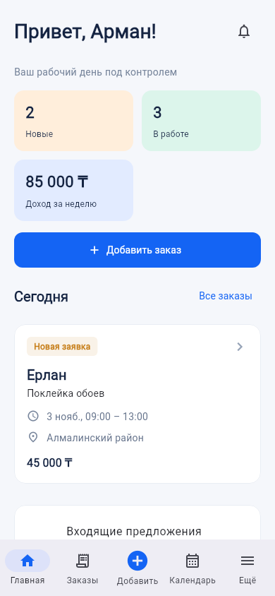
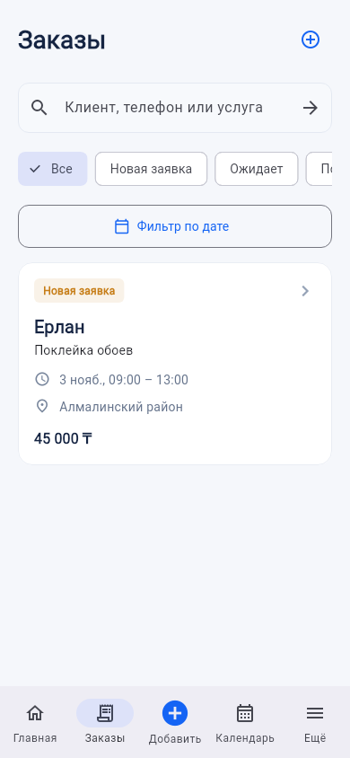
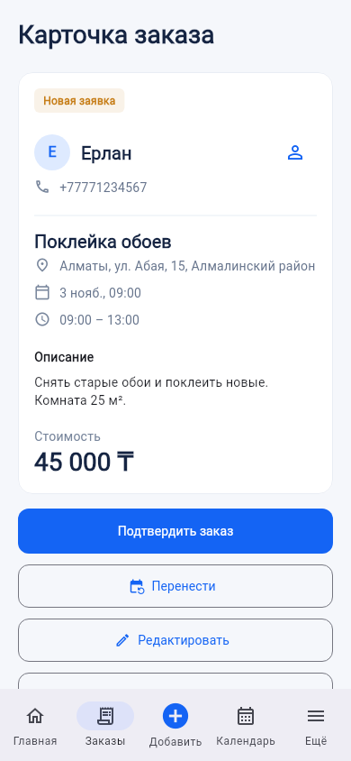
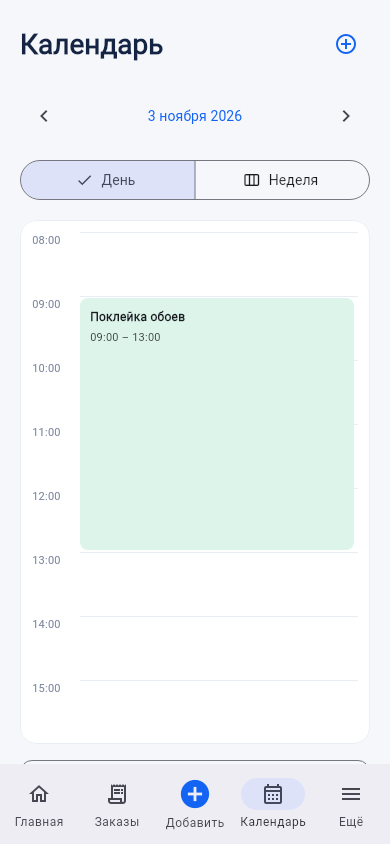
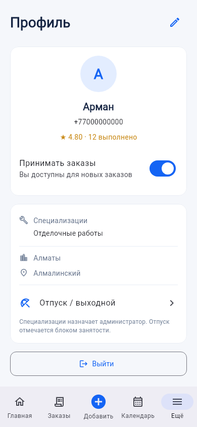
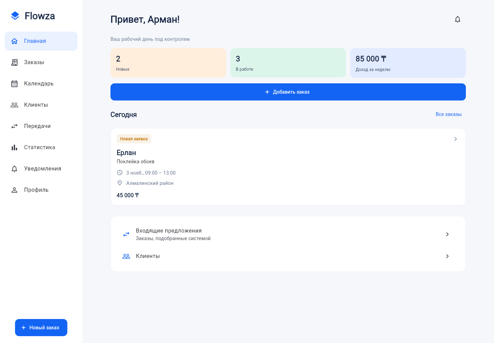

# Flowza — Flutter CRM

Интерфейс подключён к Django REST API из корня репозитория. Flutter 3.47.6 / Dart 3.13.5.

## Запуск на Windows

Сначала запустите backend по корневому README. В отдельном PowerShell:

```powershell
cd frontend
flutter pub get
flutter run -d chrome --web-port=8080 --dart-define=API_BASE_URL=http://localhost:8000/api/v1/
```

Порт 8080 уже включён в `.env.example` backend. Если меняете адрес фронтенда, добавьте его в `CORS_ALLOWED_ORIGINS` и перезапустите API. Базовый URL должен заканчиваться `/api/v1/`.

Вход — телефон/email и пароль, заданные администратором. Публичной регистрации нет. Для локальной проверки создайте demo-данные по корневому README: телефоны `+77000000000`, `+77000000001`, `+77000000002`; пароль задаёте сами через `DEMO_PASSWORD`.

## Экраны и действия

| Раздел | Возможности |
|---|---|
| Главная | Сводка за неделю, реальные заказы на сегодня, быстрые переходы |
| Заказы | Поиск, статус, дата, постраничная загрузка, ручное создание/редактирование |
| Карточка заказа | Подтвердить, начать, завершить, оплатить, перенести, отменить; история статусов, передач и платежей |
| Клиенты | Поиск, создание, редактирование, заметки, история заказов |
| Календарь | День с сеткой времени / неделя; типы блоков; добавление из свободного времени; редактирование/удаление личной занятости |
| Передачи | Автоматический подбор системой; входящие предложения, принятие/отклонение и история |
| Уведомления | Все/непрочитанные, отметка прочитанным, переход к заказу или входящей передаче |
| Статистика | День/неделя/30 дней; доход, выполненные, активные, новые, отменённые и переданные |
| Профиль | Имя, телефон, email, город, районы, доступность, специализации, отпуск |
| Администратор | Выбор мастера в форме заказа/занятости, фильтр календаря, ссылка на Django admin |

Мобильная версия использует нижнюю навигацию, широкая — боковую. Данные берутся из API; демо-режима с выдуманными заказами в приложении нет.

Передача не даёт мастеру выбирать получателя: сервер выполняет подбор. После отправки показано **предложение отправлено**, окончательная передача происходит после принятия. Отказ/конфликт сервера отображаются сообщением, данные обновляются.

Перед созданием заказа проверяется свободное время через `schedule/check/`; окончательную проверку при бронировании выполняет сервер. Подтверждённый заказ переносится отдельным действием, а не PATCH времени.

Отметка заказа «Оплачен» задаёт статус и итоговую цену. Для учёта дохода создайте запись в разделе «Платежи». Это бухгалтерский учёт, не эквайринг.

## Проверки

```sh
flutter pub get
dart run build_runner build
flutter analyze
flutter test
flutter build web --release --no-web-resources-cdn
```

DTO генерируются `json_serializable`, ошибки — `freezed`. Сгенерированные файлы и `pubspec.lock` сохранены. Unit/provider/widget тесты покрывают JWT refresh, ротацию пары токенов, конкурирующие 401, выход во время refresh, фильтры и пагинацию, login, состояния списка, подтверждение заказа и адаптивность.

Для интеграционного теста с настоящим локальным Django установите Python и зависимости корневого `requirements.txt`, затем из `frontend`:

```sh
python tool/live_smoke.py
```

Скрипт создаёт временную SQLite БД, применяет миграции, запускает тестовый API и проверяет Flutter API-клиент: login → create → confirm → calendar → complete → payment → automatic transfer → refresh → logout. Переменная `FLUTTER_BIN` задаёт путь к Flutter при необходимости. В GitHub Actions используется отдельный PostgreSQL 16, тестовый пароль не является паролем приложения. Обычная переменная `DATABASE_URL` игнорируется, чтобы не затронуть рабочую БД. Для отдельной тестовой PostgreSQL задайте `FLOWZA_SMOKE_DATABASE_URL`.

## Сборки

Web: готовая статика в `build/web`, пример SPA-конфигурации Nginx — `nginx.conf.example`. Для рабочего сервера собирайте с `--dart-define=API_BASE_URL=https://api.example.com/api/v1/` и настройте HTTPS/CORS. `flutter_secure_storage` в web требует HTTPS или localhost. Проверена обычная JS-сборка, WebAssembly не включён.

Android emulator: backend хоста доступен как `http://10.0.2.2:8000/api/v1/`; debug-манифест допускает локальный HTTP. Для production используйте HTTPS.

```sh
flutter run -d <device-id> --dart-define=API_BASE_URL=http://10.0.2.2:8000/api/v1/
flutter build apk --release --dart-define=API_BASE_URL=https://api.example.com/api/v1/
```

iOS: необходим macOS/Xcode; настройте signing, HTTPS и Keychain capability для secure storage. В Android/iOS созданы платформенные проекты, их native-сборки в текущей среде не проверялись. Bundle/application ID `com.example.flowza` замените перед публикацией в магазинах.

## Границы текущего API

Специализации назначает администратор через Django admin. Еженедельные рабочие часы не имеют endpoint в backend; занятость/отпуск отмечаются блоками MANUAL/UNAVAILABLE. Районы сохраняются текстовым списком. Расстояние, геолокация и дневной график доходов не показываются, поскольку API не отдаёт соответствующих данных. Сводка дохода учитывает записи платежей; число unread считается по API.

Приложение готово для локального запуска. Публичный staging/HTTPS-хостинг и публикация в магазинах ещё не настроены.

## Внешний вид

Ниже — снимки настоящих Flutter-экранов с тестовыми данными, не данные пользователя:








Для повторного снятия на Linux:

```sh
FLUTTER_ROOT=/path/to/flutter flutter test --update-goldens test/visual_test.dart --dart-define=CAPTURE_UI=true
```

Захват использует шрифты SDK и DejaVuSans из `/usr/share/fonts/truetype/dejavu/`. По умолчанию capture-тесты пропускаются.
